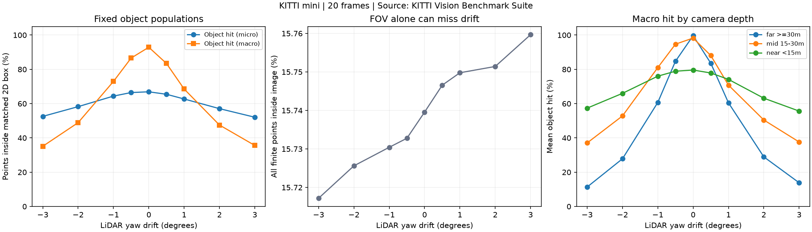
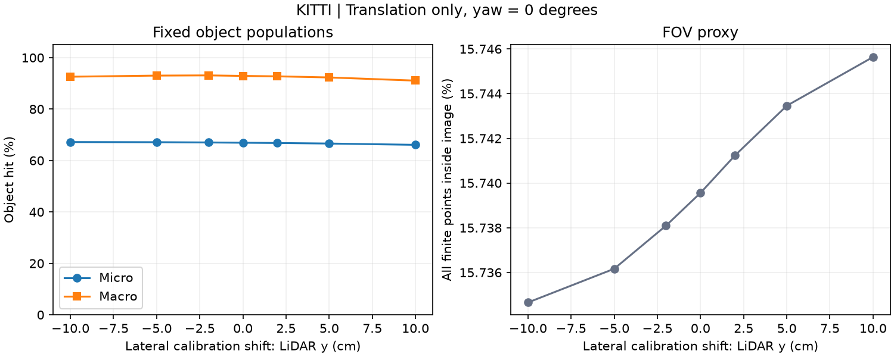
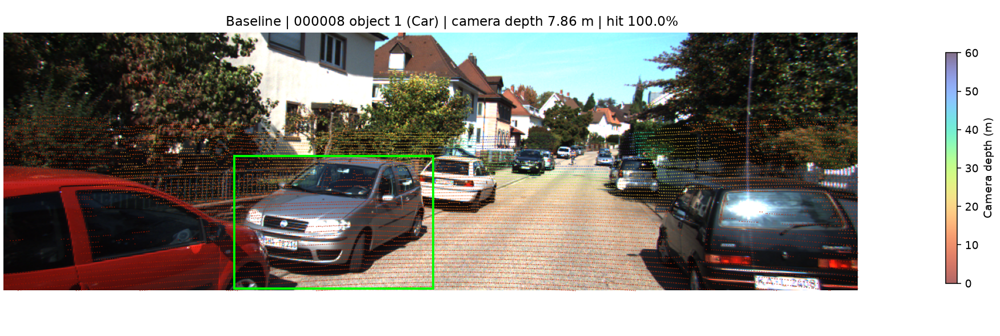
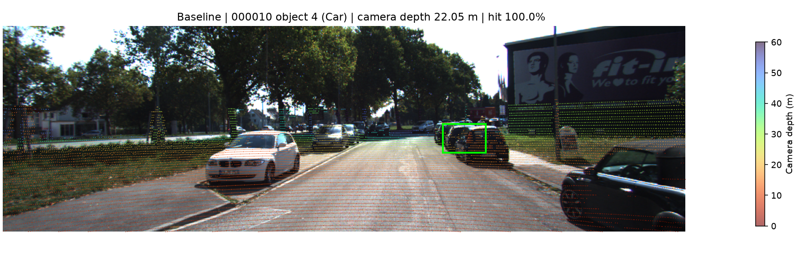
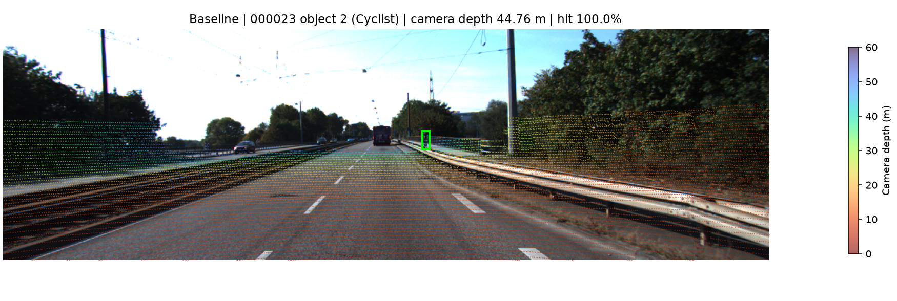
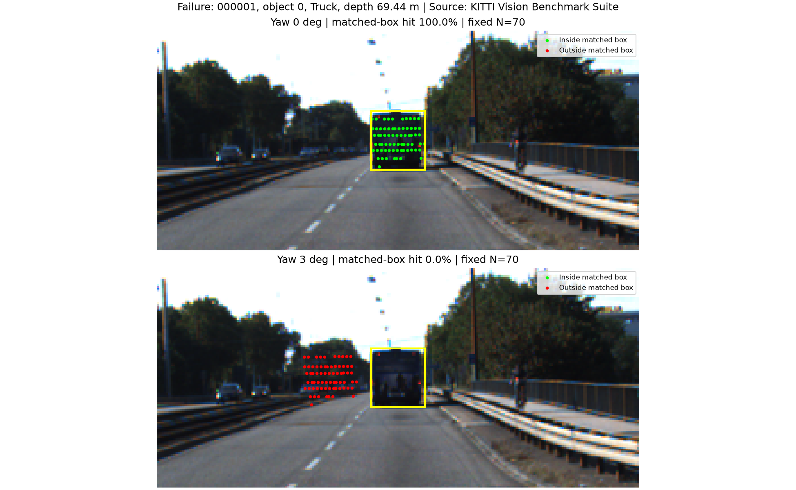

# Báo cáo Day 6: Phát hiện lệch yaw LiDAR-camera bằng độ khớp với object

- **Họ tên:** Nguyễn Hải Hoàng
- **MSSV:** 2A202602489
- **Lớp:** K4B
- **Link repo:** https://github.com/hoang9605/NguyenHaiHoang-2A202602489-Track4-Day21
- **Topic:** A — LiDAR-camera projection QA
- **Dataset:** data/synthetic (kiểm tra), data/kitti_mini (thí nghiệm chính)
- **Các frame đã dùng:** synthetic 000000–000004; KITTI 000001, 000004, 000007, 000008, 000009, 000010, 000011, 000012, 000015, 000016, 000019, 000021, 000023, 000025, 000031, 000032, 000043, 000048, 000049, 000061.

Nguồn dữ liệu/ảnh: KITTI Vision Benchmark Suite. Không train model; toàn bộ thí nghiệm chạy CPU.

## 1. Claim

Trên **106 object của 20 frame KITTI**, lệch yaw **+1°** làm tỷ lệ khớp box trung bình theo object (**macro**) giảm từ **92,89% xuống 68,52%**, tức **24,37 điểm phần trăm**; ở **+3°** còn **35,60%**. Tỷ lệ điểm trong FOV chỉ tăng **0,0201 điểm phần trăm** ở +3°, nên riêng FOV không phản ánh đúng suy giảm alignment trong thí nghiệm này.
Kết luận chỉ áp dụng cho subset, class và quy tắc chọn điểm bên dưới; không khẳng định ngưỡng này đúng cho mọi sensor/cảnh.

## 2. Evidence

Quét yaw **−3, −2, −1, −0,5, 0, +0,5, +1, +2, +3°**, chỉ đổi extrinsic quanh z LiDAR; giữ ảnh, label, P2 và R0_rect. Seed **21**, không lấy mẫu ngẫu nhiên.
Chọn Car/Van/Truck/Pedestrian/Cyclist có >=10 điểm trong 3D GT ở calibration gốc: **106/113 object**, **59.636 cặp điểm-object** cố định mỗi cấu hình; 7 object thiếu điểm bị loại. Điểm mất FOV vẫn tính là miss.
**Micro** = tổng hit / tổng điểm-object; **macro** = trung bình tỷ lệ hit từng object; **FOV** = tổng điểm trong ảnh / tổng điểm XYZ hữu hạn. Micro baseline thấp hơn macro vì xe gần bị cắt cụt có nhiều điểm ngoài ảnh; không loại các case này sau khi xem kết quả.

| Yaw (°) | Hit micro (%) | Hit macro (%) | FOV (%) |
|---:|---:|---:|---:|
| −3 | 52,56 | 35,12 | 15,7172 |
| −2 | 58,24 | 48,90 | 15,7256 |
| −1 | 64,39 | 72,95 | 15,7304 |
| −0,5 | 66,46 | 86,58 | 15,7328 |
| 0 | 66,90 | 92,89 | 15,7396 |
| +0,5 | 65,46 | 83,44 | 15,7466 |
| +1 | 62,71 | 68,52 | 15,7498 |
| +2 | 57,07 | 47,51 | 15,7514 |
| +3 | 52,06 | 35,60 | 15,7597 |



Kiểm tra tịnh tiến riêng theo **y LiDAR (sang trái)**, giữ yaw=0°: quét **−10, −5, −2, 0, +2, +5, +10 cm** trên cùng 106 object. Macro hit lần lượt **92,58; 93,01; 93,09; 92,89; 92,72; 92,29; 91,06%**. [CSV](../results/translation_sweep.csv), [chi tiết object](../results/translation_objects.csv).
Tại −2 cm metric tăng nhẹ: tỷ lệ trong rectangle là proxy, không phải hàm lỗi hiệu chuẩn có cực trị duy nhất tại calibration gốc; không dùng việc tăng này để kết luận calibration GT sai.



CSV: [tổng hợp](../results/yaw_perturb_sweep.csv), [từng object](../results/object_metrics.csv), [từng frame](../results/frame_metrics.csv), [nhóm độ sâu](../results/range_summary.csv), [object được xét](../results/object_selection.csv). [Cấu hình và phiên bản](../results/config.json); [phương pháp chi tiết](METHOD.md).
Nhóm xa >=30 m (34 object) giảm macro từ **99,65% xuống 13,84%** tại +3°. Đây là quan sát trên nhóm, chưa tách ảnh hưởng class/che khuất/cắt cụt.
Ba demo baseline có object được đánh dấu ở độ sâu camera **7,86 m**, **22,05 m**, **44,76 m**; độ sâu này không phải khoảng cách Euclidean.





## 3. Failure case

Frame **000001**, object **0 (Truck)**, độ sâu **69,44 m**: baseline có **70/70** điểm trong box; yaw **+3°** còn **0/70**. Ảnh dưới giữ nguyên điểm và box, chỉ đổi extrinsic.
Lỗi thuộc **Geometry**: phép quay sai đẩy điểm sang trái box; box vật xa nhỏ nên dễ mất toàn bộ overlap. FOV tổng vẫn gần như giữ nguyên, cho thấy giới hạn của **Metric** nếu chỉ theo dõi FOV.
Case được chọn sau thí nghiệm theo mức giảm hit lớn nhất trong nhóm baseline >=80%, không dùng để ước lượng tỷ lệ lỗi ngoài đời. Xem [phương pháp](METHOD.md) và [metadata](../results/visual_cases.json).



## 4. Khuyến nghị nếu triển khai thật

Với ADAS kết hợp camera–LiDAR, dùng QA alignment sau bảo dưỡng/va chạm và giám sát theo thời gian. Log tỷ lệ điểm hợp lệ, FOV, số điểm/object, residual alignment theo vùng ảnh/độ sâu, timestamp lệch và phiên bản calibration; không dựa riêng vào FOV.
Trong vận hành không có GT, cần proxy độc lập như khớp biên depth–ảnh hoặc target hiệu chuẩn, rồi kiểm chứng trên dữ liệu độc lập; box detector có thể tự sai. Ngưỡng cảnh báo phải theo cảnh và được kiểm tra trên tập giữ lại, chưa được xác nhận ở bài này.
Đánh đổi: dùng toàn bộ điểm tốn CPU; sampling/giảm tần suất QA nhanh hơn nhưng dễ bỏ vật nhỏ/xa. Khi alignment giảm kéo dài, gắn cờ kiểm tra calibration và giảm độ tin cậy fusion; không tự sửa extrinsic chỉ dựa vào một frame.

## 5. Cách chạy lại

Python **3.11**, chạy từ gốc repo. Trên Windows PowerShell, tạo môi trường và cài phiên bản đã dùng:

```powershell
python -m venv .venv
.\.venv\Scripts\Activate.ps1
python -m pip install -r src/requirements-lock.txt
python tools/verify_data.py --data-root data/kitti_mini
python tools/verify_data.py --data-root data/nuscenes_mini_subset
python -m unittest src.test_projection src.test_metrics -v
python -m starter.data_health --data-root data/synthetic
python -m starter.data_health --data-root data/kitti_mini --out results/data_health_kitti.csv
python -m starter.projection --data-root data/synthetic --frame 000000
python -m starter.projection --data-root data/kitti_mini --frame 000011
python -m src.benchmark
python -m src.translation_sweep
python -m src.verify_results
python tools/check_submission.py
```

`python -m src.benchmark --help` liệt kê tham số frame, yaw, ngưỡng số điểm, seed và thư mục output. `python -m src.translation_sweep --help` mô tả sweep dịch ngang. Script chạy lại so sánh từng byte của cả 7 CSV benchmark; 7 test kiểm tra điểm tham chiếu, NaN/Inf, depth, FOV, box xoay, mẫu số và dịch ngang không chọn lại object.
Máy thực hiện dùng Python portable riêng trong `.venv/python.exe` vì Python hệ thống không có trên PATH; tại máy này thay `python` bằng `.\.venv\python.exe -X utf8`. Môi trường `.venv` không được commit; máy khác dùng quy trình chuẩn ở trên.
Xem [hướng dẫn phương pháp và vấn đáp](METHOD.md). Bonus đề nghị: **B4**, script CLI dùng lại được; không yêu cầu bonus cho các nội dung vốn bắt buộc của topic A.

## 6. Khai báo sử dụng AI

**Có sử dụng AI đáng kể.** Codex đọc đề, đề xuất topic/thí nghiệm, viết hai hàm projection, script benchmark/test, chạy lệnh, tạo hình và soạn báo cáo. Số liệu và ảnh được tạo từ code chạy thật trong repo; không dùng ảnh sinh bằng AI.

| Công cụ | Dùng cho việc gì | Bạn đã kiểm chứng thế nào |
|---|---|---|
| OpenAI Codex | Giải thích đề; triển khai, chạy thí nghiệm và soạn báo cáo | Codex chạy test số học, kiểm tra dữ liệu, mở ảnh kết quả và dùng script so sánh 7 CSV từ hai lần chạy. Đây là kiểm chứng tự động do trợ lý thực hiện. |

**Phần người học tự kiểm chứng:** chưa được xác nhận trong phiên làm việc. Người học cần tự chạy lại các lệnh mục 5, đọc `src/benchmark.py` và `report/METHOD.md`, giải thích được mẫu số, phép chiếu, các con số và failure trước khi nộp/vấn đáp. Báo cáo không nhận thay rằng người học đã thực hiện các bước này.
